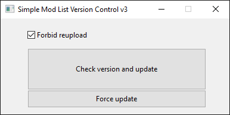
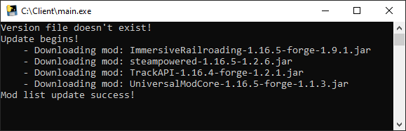

# Simple Mod List Version Control

## Description

This repository exists for those who want to share and sync mods with others. Especially useful when you want to quickly send updates to your friends or clients if you own a server.

## How it works

All mods and instructions are stored on the web server. When the client wants to update, the program compares installed version on his local machine with version on the server. If program sees that the server has a newer version, it executes the instructions for installing from server.
`Important note: The program will not follow intermediate updates (for example, if you are on version 1 and the new version is 3, then version 3 will be installed immediately). If you want the instructions of intermediate versions to be taken into account, add them to the last one`

## Getting Started

First of all, you need a working web server (Also can be used inside of local network).
`In my case it was Apache24`, you can use whatever you want.
Add the `version.json`, `1.json` to the webserver and `index.html` if needed.
Configurate it (Use this as an example [EXAMPLE](ServerHTDOCS_Example/README.md))
Then configurate the `conf.json` client file. Replace the address with yours web server address.
Share executable and `conf.json` to your client. Enjoy!

## How to build

Search for PyInstaller and build main.py
`py -m PyInstaller --onefile main.py`

## TODO list

* Intermediate updates support
* Regular expressions

## Author

* **Andrii Bondarenko** - [PraydE](https://github.com/PraydE007)

## License

* This project is licensed under the MIT License - see the [LICENSE](LICENSE) file for details

